# Hi there, I'm Zichen Luo (罗子辰) 👋

I am a 4th-year Physics undergraduate at Tsinghua University studying nuclear physics. Currently working on detectors for my thesis, though I dabble in machine learning from time to time. And I like long-distance running too.

---

### 🔬 Physics & Research
* **Academic Affiliation**: 4th-year Undergraduate, Department of Physics, Tsinghua University.
* **Thesis Project**: *Development of Polarization Detectors in Deuteron Isovector Polarization Experiments*.
* **Advisor**: Prof. Xiao Zhigang.
* **Technical Skills**: Geant4, SolidWorks, Altium Designer, Python, C++.

### 💻 Tech & AI Projects
* **[NeonBench](https://github.com/luozichen/NeonBench/)**: A systematic study of numerous transformer architecture ideas. Includes logs from nearly 300 experiments of models ranging from 3M to 26M parameters.
* **[Neon Connect](https://luozichen.pythonanywhere.com)**: A custom web-based visualizer for my models. (Attention sinks, dimensional collapse, etc)
    * [Source Code](https://github.com/luozichen/NeonConnect/)
* **[HuggingFace](https://huggingface.co/luozhangzichen)**: A repository for larger model weights and specific architectural variants.
* **Technical Skills**: PyTorch, Python (Flask), LLM API integration.

---

### 📊 GitHub Stats

---

📫 **More about me**:
* [Personal Website](https://luozichen.github.io)
* [Neon Connect Platform](https://luozichen.pythonanywhere.com)
